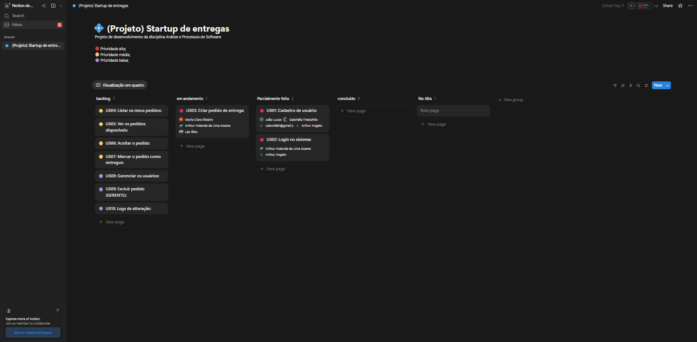

# 🚀 Sweetly 
📦 Aplicativo de entregas de doce da disciplina **Análise e Projeto de Software** 

Já pensou em um serviço _Delivery_ que entrega doces? Se sim, nós temos a solução perfeita!

O Sweetly é uma aplicação desenvolvida para os amantes de doces com as melhores sobremesas. Seja um Cookie, brigadeiro, açai, bolos, Sorvetes. Tudo focado em DOCES!
---

## Notion

## 🔧 Pré-requisitos  
Antes de começar, certifique-se de ter instalado:  
- ⚙️ **Node.js 18+** (inclui o **npm**)  
- 📦 **npm** (já vem junto com o Node.js) ou, se preferir, **Yarn** como gerenciador de pacotes  
- 🖥️ **Git** (para clonar e versionar o projeto)

---

### US01 – Cadastro de usuário
Usuário cadastra informando nome, email e senha. Validações de dados e email existente incluídas.  
.png)

### US02 – Login no sistema
Usuário realiza login com usuário/email e senha. Validações das credenciais incorretas incluídas.  
.png)

### US03 – Criar pedido de entrega
Cliente cria pedido informando item e endereço com validação de dados.  
.png)

### US04 – Listar meus pedidos
Cliente visualiza todos os pedidos realizados e acompanha os status.  
.png)

### US05 – Ver pedidos disponíveis
Entregador visualiza os pedidos pendentes para escolher qual pretende aceitar.  
.png)

### US06 – Aceitar pedido
Entregador aceita o pedido para realizar entrega.  
.png)

### US07 – Marcar pedido como entregue
Entregador finaliza entrega e atualiza status do pedido.  
.png)

### US08 – Gerenciar usuários
Gerente visualiza lista de usuários e detalhes.  
.png)

### US09 – Excluir pedido
Gerente exclui pedidos incorretos ou inválidos verificando se tem erros.  
.png)

### US10 – Logs de alteração
Gerente visualiza histórico de alterações e pode filtrar as informações presentes.  
.png)

